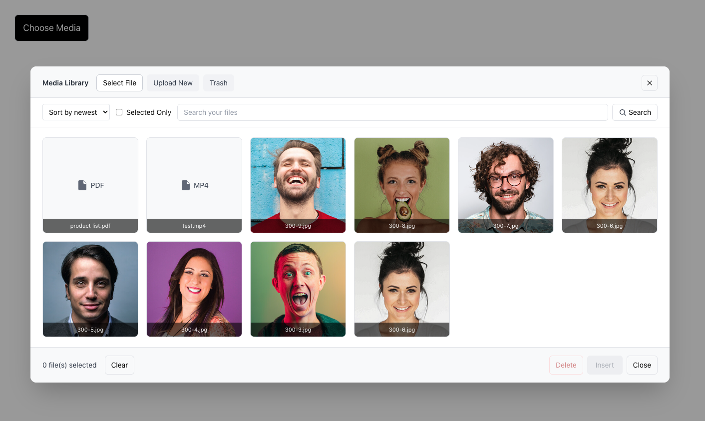

# Livewire Media Selector

[](https://packagist.org/packages/drpshtiwan/livewire-media-selector)
[](https://packagist.org/packages/drpshtiwan/livewire-media-selector)
[](LICENSE)
[](https://github.com/drpshtiwan/livewire-media-selector/actions)
[](https://github.com/laravel/pint)
[](composer.json)

A lightweight, WordPress-style media selector for Laravel applications powered by Livewire.  
Full documentation: [livewire-media.thejano.com](http://livewire-media.thejano.com/)


## Screenshots



### Video demo

[](https://www.youtube.com/watch?v=4Snjk2213ls)

### Features

- Browse, search, and paginate media stored on your Laravel disks
- Upload new files (respecting size, extension, and mime limits)
- Single or multiple selection with drag-to-reorder support
- Optional collections to group media per feature (e.g. `gallery`, `avatars`)
- Trait helpers (`attachMedia`, `syncMedia`, `getMediaUrl`) for quick model integration
- Soft delete, restore, and optional trash tab when you need moderation
- Emits Livewire/browser events so you can react to uploads, deletes, and selections
 
#### UX & i18n updates
- Action buttons are hidden by default and appear on hover (non-interactive when hidden)
- Clear, thicker selection ring with offset for better contrast
- Select File tab is the default when the modal opens
- New `can_upload` config and `:canUpload` attribute to disable Upload tab and uploads
- RTL support (auto when locale is Arabic/Kurdish/etc.); key positions flip in RTL
- Translations included (English, Arabic, Kurdish/Sorani) with publishable lang files
- Component inherits your app’s font-family

## Installation

### Requirements

- PHP >= 8.3
- Laravel 12–13
- Livewire 3.5+ or 4.x

Note: Laravel 11 and earlier are not supported — Laravel 11 reached its security-fix end-of-life in March 2026. For older Laravel versions, use the `1.x` line of this package.

Require the package:

```bash
composer require drpshtiwan/livewire-media-selector
```

Publish the config (optional):

```bash
php artisan vendor:publish --tag=media-selector-config
```

Publish the migration and run it:

```bash
php artisan vendor:publish --tag=media-selector-migrations
php artisan migrate
```

Ensure your `public` disk is set up and linked:

```bash
php artisan storage:link
```

Publish the views (optional, if you want to customize the markup/classes):

```bash
php artisan vendor:publish --tag=media-selector-views
```

Publish the assets (CSS):

```bash
php artisan vendor:publish --tag=media-selector-assets --force
```

Simple usage:

```blade
<livewire:media-selector wire:model="media" collection="gallery" />
```

[Read the docs](http://livewire-media.thejano.com/) for setup details, configuration options, and integration patterns.

## Security

The selector enforces a clear trust boundary between what the **server** controls and what the **browser** may change:

- **Permission and config are server-only.** Flags such as `canDelete`, `canUpload`, `canSeeTrash`, `canRestoreTrash`, `restrictToCurrentUser`, the allowed file types (`mimes`/`extensions`), the storage `disk`/`directory`, and upload limits are `#[Locked]` Livewire properties. They are resolved once in `mount()` from the attributes you pass and from config; a crafted Livewire request **cannot** flip a permission, widen the allowed file types to smuggle an executable upload, or repoint the storage location.
- **Derive permissions from your own authorization.** Pass the flags from policies/gates, e.g. `:can-delete="auth()->user()?->can('delete', $model)"`. The package will not grant an action you did not enable.
- **Selections and deletions are re-validated server-side** against the active, scoped query — a user can never select, insert, or delete media outside the disk/collection/owner scope they are viewing.
- **SVG uploads are disabled by default.** SVG files can embed `<script>`/event handlers, so serving them from a public disk by URL is a stored-XSS vector. They are omitted from the default `allowed_extensions`; if you re-enable them, sanitize uploads (e.g. `enshrined/svg-sanitize`) or serve them with `Content-Disposition: attachment` / a restrictive CSP. Note the `image/*` MIME wildcard also matches `image/svg+xml`.

## Changelog

See [CHANGELOG.md](./CHANGELOG.md) for recent and upcoming changes.

## Developer

Developed and maintained by [drpshtiwan](https://github.com/drpshtiwan).

## License

MIT License. See `LICENSE` for details.
